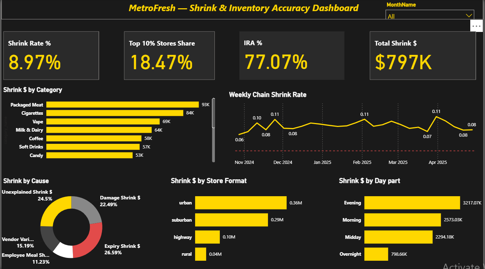
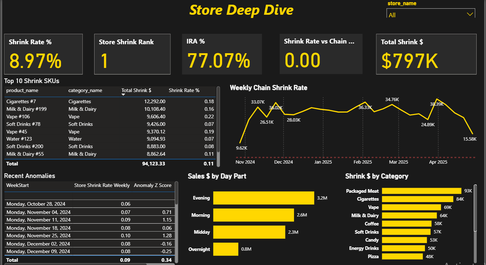
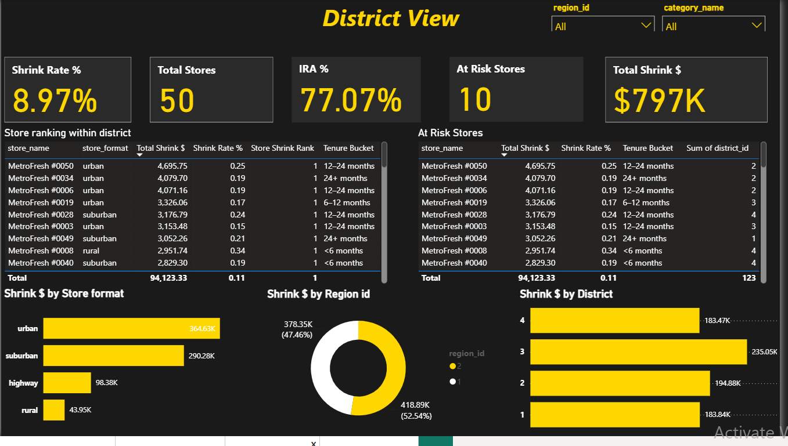
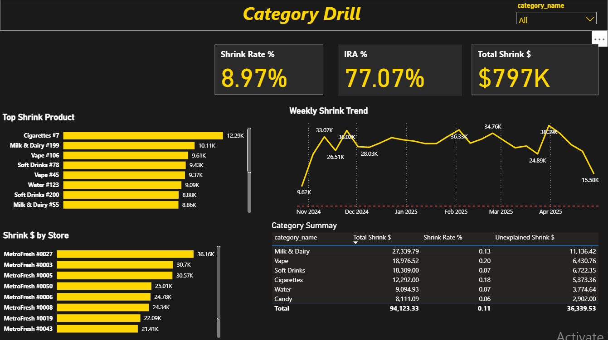

# MetroFresh Shrink & Inventory Accuracy Analysis

## Project Overview
A full end-to-end Power BI analytics solution analyzing inventory 
shrink across a fictional 50-store convenience chain called MetroFresh.

Built to demonstrate real-world data analyst skills across the full 
workflow — from raw CSV data to executive-ready dashboards.

---

## Key Findings
- 💰 **$797K** in total shrink across 27 weeks
- 📉 Chain shrink rate at **8.97%** vs 1.95% industry target
- 🏪 **Urban stores** drive 45% of all shrink
- 🚬 **Packaged Meat & Cigarettes** are the top shrink categories
- ⚠️ **10 stores** have managers with tenure under 6 months — 
  showing significantly higher shrink rates
- 🔍 Z-score anomaly detection flagged specific store-week 
  combinations spiking above 2 standard deviations

---

## Dashboard Pages

### Store Deep Dive
Per-store KPIs, top shrink SKUs, anomaly flags, 
weekly trend filtered by store

### District View
District and region rollups, at-risk store callouts, 
store rankings within district

### Category Drill
Category and SKU level shrink breakdown, 
weekly trend by category

---

## Technical Stack
| Tool | Usage |
|---|---|
| Power BI Desktop | Dashboard and data model |
| Power Query (M) | Data cleaning and shrink_fact table |
| DAX | 50+ measures |
| CSV files | 10 synthetic tables, 486K+ rows |

---

## Data Model
- **4 fact tables:** pos_transactions, inventory_receipts, 
  inventory_adjustments, cycle_counts
- **1 derived fact table:** shrink_fact (built in Power Query M code)
- **8 dimension tables:** stores, products, categories, 
  employees, shifts, Date, Day_Part, external_factors
- **16 relationships** in a star schema

---

## Key DAX Measures
- `Total Shrink $` — sum of all shrink causes
- `Shrink Rate %` — shrink as % of total sales
- `IRA %` — inventory record accuracy
- `Anomaly Flag` — Z-score statistical control chart
- `Top 10% Stores Share` — Pareto concentration
- `Store Shrink Rank` — ranked across all 50 stores
- `Shrink Rate vs Chain Avg` — store vs chain benchmark

---

## Author
**Moyosore Salami**
Accounting Graduate | Data Analyst

🔗 [LinkedIn](https://linkedin.com/in/moyosore-salami-aba604390)
📂 [GitHub](https://github.com/Moyosore0306)
